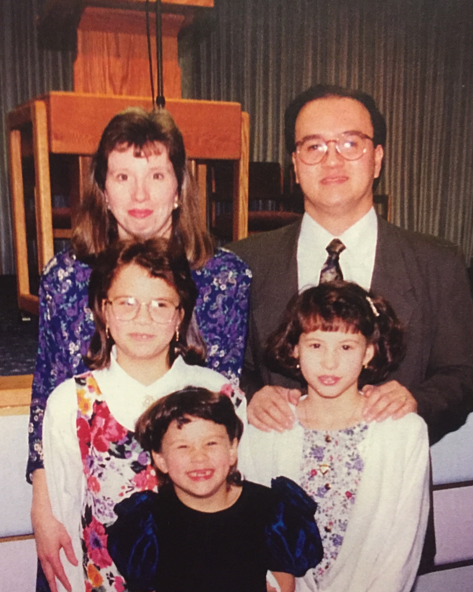

#### 1/5/2017
# Compulsory Devotion

*My family at a Circuit Assembly in Woodburn. Oregon, early 90's, I'm the one with the bad hair.*

I was raised in a Jehovah's Witness family. Although not universally recognized as a cult, JW's fit the definition perfectly. But don't just take my word for it, read more at sites like [JWfacts](https://www.jwfacts.com/). Growing up, this meant that our lives revolved around JW activities.

Sunday morning we met at the Kingdom Hall to listen to a talk, followed by a question and answer discussion of the current issue of the Watchtower. Monday and Tuesday evenings were spent in personal Bible study and preparing student assignments for the ministry school, which was on Wednesday evening. Thursday was the small group Bible study (this one was my favorite because we usually met at someone's house and had desert after). Friday was used to prepare for the ministry, and Saturday was spend going door-to-door and driving around trying to find someone to "witness" to. Then there's the twice yearly 2-day assembly where we met in a really big Kingdom Hall with hundreds of other JW's and the 3 day annual convention, which was basically the same thing but bigger. These repeated activities, although presented as ways to draw closer to out god (and away from the world) was really just an infinite loop of boredom and brainwashing.

The little free time we had was usually spent together. I didn’t have many friends because we weren’t allowed to play with "worldly," or non-JW children, outside of school hours. Actually, my mom would scold me if I referred to a class mate as a "friend."

Family visits with non-JW aunts, uncles and cousins were always kept short and highly supervised, since they could potentially be "bad influences" and we always needed "keep our guards up." Since it was against our beliefs to celebrate birthdays and holidays, socializing on those occasions were strictly forbidden. Thankfully my sisters and I were allowed to watch TV, but everything from the Simpsons to Fantasia was considered bad and watching one minute of it was forbidden. Surprisingly I got used to this kind of monopoly on my time and relationships, but it's not like I knew any different.

In my teen years, both of my older free-spirited sisters broke free from the church and out parents control, leading to their removal from the congregation, our home and total ex-communication from me and my parents. It was really traumatic see my family divided and the pain of loosing my sisters was unbearable. With two children lost to Satan’s "wicked" world, my parents were not taking any chances with their me, their youngest and most submissive daughter. So they beefed up surveillance on my daily whereabouts, associates, activities, pursuits and general doings 24/7. Dreams of a university education were quickly extinguished and replaced with goals of becoming a full-time minister and finding a perfect JW husband.

In high school I excelled in math and science, and thoroughly enjoyed the challenge of learning new and complicated subjects. My teachers and guidance counselors encouraged me to take AP classes and apply for scholarships in engineering. Sadly JW leaders strongly advise parents not to allow their children to attend universities or purse a "higher education" for fear this might lead them astray (see the Watchtower article [Parents - What Future Do You Want for Your Children?]("https://wol.jw.org/en/wol/d/r1/lp-e/2005726")).

So my parents were constantly warning me of the dangers of colleges and the consequences if I choose to attend. I was persuaded to learn some kind of trade so I can work part-time to support my full-time evangelizing. Not wanting to displease my parents, I gave up my educational desires and maneuvered to go to community college. In just two short years which took a lot of persuading to go that long I finished my barely challenging engineering tech degree and landed a promising part-time engineering job.

Over the years I learned an essential skill to be a Jehovah’s Witnesses is learning how _not_ to live up to your potential. I had thousands of examples to learn from, like JW’s that turned down ivy league scholarships to work as janitors or window washers. Women that were natural leaders choosing silent submission because of their gender. Talented artists persuaded to demote their talents to a hobby in order make room for the ministry. Ambitious people with aspirations for a successful career forced into mediocrity so as not to risk becoming "enslaved to riches." It’s hard to imagine, but living in this world where literally everything is a threat to your spirituality and relationship with god, underachieving or sabotaging your success was recognized as an act of godly devotion.

Despite my parent’s fears and criticism from the congregation elders, a college degree and a good job did not make me fall out of "the truth." On the contrary, I was able to secure part-time hours, so I could devote the rest of my time to the ministry. Since I was becoming a master underachiever, I managed to keep my job challenging enough to say engaged, but not challenging enough to get excited. So worked in a kind of ambition neutralizing environment, where I didn’t need to expend much brain power to do my job. Deep down I knew I was capable of more and owed it to myself to find out, but would never get that opportunity.