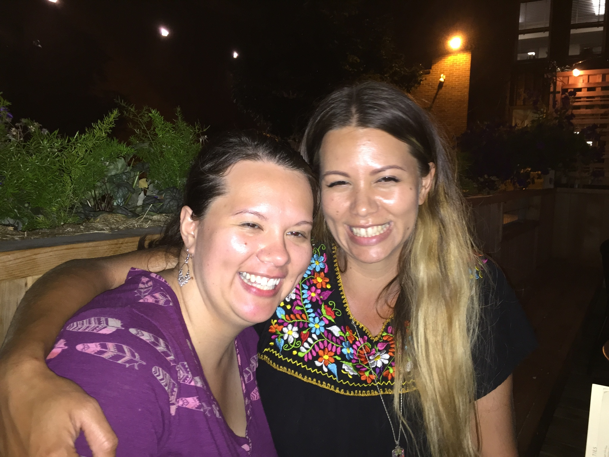

# Reuniting With My Sister
7/1/2015



Yesterday I saw my sister for the first time in about 15 years. We were close a kids, until she moved out at 17. She had decided to leave the church, although she left over a period of a few years. Because she left 'the Truth', she was considered bad association and my parents feared I would follow in her footsteps. So they limited my contact with her. Eventually I was no longer allowed to have contact with her at all, and was forced to not return her calls or texts. My mother even made change me phone number so she would not be able to contact me.

During that time apart I missed her terribly. I cried every time I thought about her and carried that pain in my heart everyday. I knew she loved me, and although I couldn't understand why she left, I hoped we'd be reunited someday. Fast Forward to over a decade as I finally decided that I was going to leave the church, I sent the email below in an effort to rekindle our relationship. I was excited, but also nervous because I wasn't sure how a decade of shunning has altered our sisterly bond. I also knew my parents would be really upset if they found out.

```
From: Christy
Sent: Jun 2, 2015 3:52 PM

I found your email from your website so I hope you don't mind sending a message to it. I know contacting you now might come as a surprise, but I would really like to talk to you. I miss you and it's been too long since I've acted like you sister and I really regret it. Mom and Dad don't know I've been trying to get a hold of you, and I haven't told Amy. This might sound weird but I don't want them to know just yet. I really hope you want to see me, there's so much I want to tell you. 

Love,
Christy
```

```
From: Missy
Sent: June 24, 2015 3:56 PM

I want to see you everyday. 
I think of you often and you've never been far from my heart. 
When are you free next? 
I respect your wishes on who knows what.
```

```
From: Christy
Sent: Jun 24, 2015 10:21 PM

Ok, just let me know when is good for you.

Currently I'm regular pioneering and working part-time for and HVAC distributor. I work only Tuesdays and Thursdays, and I'm usually out in service every other day of the week. But I can be flexible with my schedule.

My life right now is kind of weird. A while back I started to seriously question my beliefs, specifically if you can only find happiness if you are one of Jehovah's Witnesses. That might sound crazy to non-JWs, but I'm sure you remember that as JWs, we can have black and white view of things. To make a long story short, all this questioning has made me realize that I don't want to be a JW anymore. This is really big for me, especially because my entire life revolves around the witnesses.

I haven't told mom or dad yet and I'm dreading it. I want to be open and honest about what I believe, but when I do I'm pretty sure it will lead to me being disfellowshipped. That's going to devastate them, so I'm trying to decide how to do it that will hopefully make it easier on them (hence the secrecy). Plus I have some other things to get in order before that happens.

It's taken me a while to realize that the main reason why we are not close anymore is because I chose my religion over family. I don't expect you to forgive me, but please know that I am deeply and truly sorry for shutting you out for all these years. I'm your sister and I should have been there for you. I'm sorry that it's taken me this long to realize it but we're not old yet, and maybe we can make up for lost time.

Please excuse my ignorance but what is a ""spanish-swedish-shoshone medicine woman""? Are you still in the Portland area? What kind of plants do you grow?

You can text me if you want

Christy
```

```
From: Missy
Sent: June 25, 2015 6:08 PM

I know comparing your transformation in life right now is so cliche with a butterfly. There is a reason that became such a wildly used expression!!

In the chrysalis stage the caterpillar basically melts into an oozy goo of dna. The transformation into its next stage in life means they have to complete dismantle who they thought they were because their new, most expressive self is an entirely different being, presence and possibility. Their point of view changes, their diet changes, their exoskeleton grows an entirely new body.

I hope you take that as both preparation and anticipation for your path of honoring who you authentically are.

I went through the whole gamete of emotions during my huge transformation into being the person I know I am deep inside. In fact, the transformation keeps going and going. Many cycles of growth in personal development and acceptance of how I need to live to experience happiness that is fine tuned to this life.

Taking charge and allowing yourself to live with yourself and for yourself is not selfish. Because by doing that you are honest, pure and true. That is the way to live. It then becomes a present for all those around you. You're being honest with them with who you are. Therefore, they can give themselves permission to be honest with themselves and those around who the really and truly are. It's a ripple effect of understanding, attuning and activating our life purpose in the most authentic way we can.

That's my religion. Happiness is when you are exactly as you are. Not how you wish to be or what others expect you to be. As you are.

There is nothing to forgive. Patience is a quality I work on regularly. I knew you would see through the veil one day. All organized religions cloud mental clarity with fear and submission.

I praise your courage and am excited to offer you loving support through this shift in your life.

Sleeping will become so peaceful you'll only need 5 hours instead of 8!

Let's meet tomorrow around 4pm?

I love you,
Missy
```

We met that following Friday, hugged, talked and cried. I can only describe reuniting with my sister as one of the happiest days of my life.

Although we had a few brief encounters over the years, this was the first time we were really able to talk openly and honestly (and at length). She still has the same familiar face and expressions as I remembered, but in many ways is a complete stranger to me. I guess that’s what happens.

As she talked about her beliefs on life and family, I couldn't help but envy her conviction. For years I painted myself as the solidly grounded one, unchanging with a strong sense of identity. Yet, as I looked at her and listened to her speak, it was clear that I was wrong. She wasn’t lost, being “tossed about as by waves and carried hither and thither.” In fact, it was the complete opposite! I was now the lost one, while my sister was doing what she had been all these years, being herself.